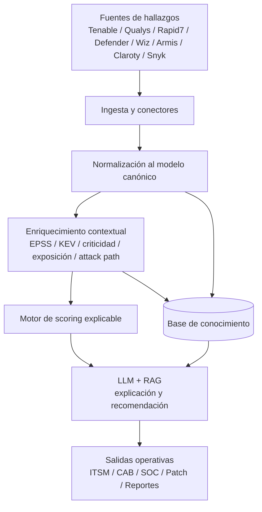

# Agente de IA para Gestión de Vulnerabilidades

<p align="center">
  
  
  
  
  
</p>

Sistema orientado a la **priorización, análisis, contextualización y recomendación de remediación de vulnerabilidades** en entornos **IT, OT, Cloud y AppSec**, combinando:

- **scoring determinístico explicable**
- **enriquecimiento contextual**
- **RAG (Retrieval-Augmented Generation)**
- **LLM** para explicación, justificación y apoyo a la toma de decisiones

---

## Tabla de contenido

- [1. Visión general](#1-visión-general)
- [2. Problema que resuelve](#2-problema-que-resuelve)
- [3. Objetivos](#3-objetivos)
- [4. Alcance](#4-alcance)
- [5. Arquitectura de referencia](#5-arquitectura-de-referencia)
- [6. Arquitectura en Mermaid](#6-arquitectura-en-mermaid)
- [7. Componentes del repositorio](#7-componentes-del-repositorio)
- [8. Modelo canónico de datos](#8-modelo-canónico-de-datos)
- [9. Lógica de priorización](#9-lógica-de-priorización)
- [10. Estructura RAG recomendada](#10-estructura-rag-recomendada)
- [11. Flujo operativo](#11-flujo-operativo)
- [12. Instalación](#12-instalación)
- [13. Ejecución básica](#13-ejecución-básica)
- [14. Integración futura](#14-integración-futura)
- [15. Casos de uso](#15-casos-de-uso)
- [16. Roadmap](#16-roadmap)
- [17. Métricas de éxito](#17-métricas-de-éxito)
- [18. Seguridad y gobierno](#18-seguridad-y-gobierno)
- [19. Estructura sugerida del proyecto](#19-estructura-sugerida-del-proyecto)
- [20. Contribución](#20-contribución)
- [21. Licencia](#21-licencia)
- [22. Resumen ejecutivo](#22-resumen-ejecutivo)

---

## 1. Visión general

Este proyecto define la base de un **Agente de IA para Gestión de Vulnerabilidades** capaz de:

- recibir hallazgos desde múltiples herramientas de seguridad,
- normalizar la información en un modelo unificado,
- enriquecer cada hallazgo con señales de amenaza y contexto del activo,
- calcular un **riesgo operativo real**,
- recomendar acciones de remediación, mitigación o aceptación,
- y producir salidas útiles para **SOC, infraestructura, OT, AppSec, CAB y dirección**.

La propuesta no busca reemplazar inicialmente a los scanners o plataformas RBVM existentes. Su propósito es servir como una **capa inteligente de priorización y decisión**.

---

## 2. Problema que resuelve

Los programas tradicionales de gestión de vulnerabilidades presentan limitaciones comunes:

- exceso de hallazgos sin contexto suficiente,
- priorización basada solo en **CVSS**,
- baja correlación entre severidad, explotación real y criticidad del negocio,
- escasa integración entre dominios IT, OT, cloud y desarrollo,
- dificultad para traducir datos técnicos a decisiones operativas y ejecutivas,
- y baja trazabilidad entre detección, priorización, remediación y validación.

Este proyecto corrige ese enfoque mediante una priorización basada en:

- severidad técnica,
- probabilidad de explotación,
- explotación activa conocida,
- criticidad del activo,
- exposición a internet,
- reachability,
- presencia en rutas de ataque,
- disponibilidad de parche,
- antigüedad del hallazgo,
- y controles compensatorios.

---

## 3. Objetivos

### Objetivo general
Diseñar e implementar un agente de IA para apoyar la gestión integral de vulnerabilidades mediante correlación de hallazgos, priorización basada en riesgo y recomendación de acciones de remediación o mitigación.

### Objetivos específicos
- Definir un **modelo canónico de datos** para hallazgos, activos y remediaciones.
- Consolidar una **base de conocimiento** sobre herramientas, métricas y reglas de decisión.
- Implementar un **motor de scoring explicable**.
- Diseñar prompts y estructura RAG para enriquecer el razonamiento del agente.
- Producir una salida auditable para operación, gestión y dirección.
- Preparar la solución para integración con scanners, CMDB, ITSM, patching y plataformas OT/AppSec.

---

## 4. Alcance

El proyecto cubre los siguientes dominios:

- **IT Infrastructure**
- **Endpoints**
- **Cloud / CNAPP / Exposure**
- **OT / ICS / XIoT**
- **Application Security / DevSecOps**
- **Patch & Remediation**
- **Exposure Management / RBVM**

El alcance actual corresponde a una **base operativa inicial** compuesta por:

- modelo canónico,
- base de conocimiento,
- catálogos comparativos,
- reglas de scoring,
- diseño de prompts,
- estructura RAG,
- y datasets de ejemplo.

---

## 5. Arquitectura de referencia

La arquitectura se organiza en seis capas principales:

1. **Fuentes de hallazgos**  
   Scanners, plataformas RBVM, CNAPP, AppSec, OT.

2. **Ingesta y normalización**  
   ETL, APIs, conectores, limpieza y mapeo al modelo canónico.

3. **Enriquecimiento contextual**  
   EPSS, KEV, criticidad, exposición, reachability, attack path, inventario, dueños de servicio.

4. **Motor de scoring**  
   Reglas explicables para calcular `risk_score`, `risk_band`, SLA y decisión inicial.

5. **LLM + RAG**  
   Justificación auditable, recomendación contextual, resumen técnico y ejecutivo.

6. **Integración operativa**  
   ITSM, CMDB, CAB, patch management, SIEM, dashboards, reportes.

---

## 6. Arquitectura en Mermaid



---

## 7. Componentes del repositorio

- `Base_conocimiento_agente_vulnerabilidades.json`  
  Base estructurada con entidades, taxonomía RAG y reglas resumidas.

- `Catalogo_herramientas_vulnerabilidades.csv`  
  Catálogo comparativo de herramientas líderes por dominio.

- `Catalogo_metricas_vulnerabilidades.csv`  
  Catálogo de métricas clave para priorización y seguimiento.

- `Ejemplo_scoring_agente.csv`  
  Dataset de ejemplo con resultados de scoring.

- `Diseno_prompts_agente_vulnerabilidades.md`  
  Diseño de prompts del sistema y de entrada para razonamiento operativo.

- `Esquema_RAG_agente_vulnerabilidades.md`  
  Recomendaciones para chunking, metadatos y colecciones RAG.

- `reglas_scoring_agente.py`  
  Motor inicial de scoring explicable.

- `ejemplo_findings.json`  
  Hallazgos de ejemplo para pruebas.

- `ejemplo_assets.json`  
  Activos de ejemplo para pruebas.

---

## 8. Modelo canónico de datos

### Entidad `VulnerabilityFinding`
Campos esperados:

- `finding_id`
- `source_tool`
- `cve_id`
- `title`
- `asset_id`
- `cvss`
- `epss`
- `kev_flag`
- `internet_exposed`
- `reachable`
- `attack_path`
- `patch_available`
- `first_seen`
- `last_seen`
- `finding_status`
- `recommended_action`

### Entidad `Asset`
Campos esperados:

- `asset_id`
- `hostname`
- `asset_type`
- `environment`
- `business_owner`
- `service_owner`
- `criticality`
- `data_sensitivity`
- `internet_exposed`
- `ot_it_flag`
- `compensating_controls`

### Entidad `RemediationAction`
Campos esperados:

- `action_id`
- `finding_id`
- `action_type`
- `patch_or_mitigation`
- `effort_level`
- `outage_required`
- `reboot_required`
- `target_sla_days`
- `validation_required`
- `status`

---

## 9. Lógica de priorización

El modelo actual calcula un `risk_score` de **0 a 100** considerando:

- **CVSS**
- **EPSS**
- **KEV**
- exposición a internet,
- reachability,
- presencia en ruta de ataque,
- criticidad del activo,
- antigüedad del hallazgo,
- disponibilidad de parche,
- controles compensatorios.

### Bandas de riesgo
- `critical`
- `high`
- `medium`
- `low`

### Acciones sugeridas
- `patch_now_or_mitigate_immediately`
- `remediate_priority`
- `schedule_fix`
- `monitor_or_accept`

### Principios de decisión
- No priorizar únicamente por CVSS.
- Dar mayor peso a **KEV**, **EPSS alto**, **exposición externa** y **criticidad**.
- En OT, considerar continuidad operativa y mitigaciones compensatorias.
- Mantener explicabilidad y trazabilidad en cada recomendación.

---

## 10. Estructura RAG recomendada

Colecciones sugeridas:

- `tool_profiles`
- `metric_definitions`
- `decision_rules`
- `remediation_playbooks`
- `asset_criticality_policy`
- `exception_policies`
- `sla_policies`

Metadatos recomendados:

- `doc_type`
- `domain`
- `environment`
- `source_tool`
- `severity_band`
- `risk_band`
- `review_date`
- `owner_team`

### Consultas objetivo
- ¿Cómo priorizar una CVE con EPSS alto pero sin KEV?
- ¿Qué hacer si un PLC crítico no tiene parche?
- ¿Qué SLA aplicar a una vulnerabilidad crítica en un activo expuesto?
- ¿Qué métricas deben mostrarse a operación y a dirección?

---

## 11. Flujo operativo

1. Recibir hallazgos desde scanners o plataformas RBVM.
2. Mapear los hallazgos al modelo canónico.
3. Correlacionar con inventario, criticidad y contexto operativo.
4. Enriquecer con señales como `EPSS`, `KEV`, exposición y attack path.
5. Calcular `risk_score`.
6. Invocar LLM para:
   - justificar,
   - recomendar,
   - resumir,
   - sugerir equipo responsable,
   - y escalar si corresponde.
7. Enviar salida a ITSM, CMDB, CAB, patching y dashboard.

---

## 12. Instalación

### Requisitos
- Python 3.10 o superior
- `venv` o entorno equivalente
- Git

### Clonar el repositorio
```bash
git clone https://github.com/tu-organizacion/tu-repositorio.git
cd tu-repositorio
```

### Crear entorno virtual
```bash
python -m venv .venv
```

### Activar entorno virtual

#### Linux / macOS
```bash
source .venv/bin/activate
```

#### Windows PowerShell
```powershell
.venv\Scripts\Activate.ps1
```

### Instalar dependencias base
En la versión actual, los artefactos principales usan librerías estándar de Python.  
Cuando el proyecto crezca, se recomienda incluir un `requirements.txt` o `pyproject.toml`.

---

## 13. Ejecución básica

### Probar el motor de scoring
```bash
python reglas_scoring_agente.py
```

### Salida esperada
El script devuelve una estructura con:

- `risk_score`
- `risk_band`
- `recommended_action`
- `target_sla_days`
- `reasons`

### Uso sugerido
1. Cargar `ejemplo_findings.json`
2. Cargar `ejemplo_assets.json`
3. Enriquecer con inventario real y señales externas
4. Ejecutar scoring
5. Enviar el resultado al flujo LLM/RAG

---

## 14. Integración futura

### Fuentes objetivo
- Tenable
- Qualys
- Rapid7
- Microsoft Defender Vulnerability Management
- Cisco Vulnerability Management
- Wiz
- Armis
- Claroty
- Nozomi
- Snyk
- Checkmarx
- Veracode
- GitHub Advanced Security
- BigFix
- Automox
- Tanium

### Plataformas operativas
- ITSM
- CMDB
- SIEM
- sistemas de cambio / CAB
- patch management
- dashboards ejecutivos y operativos

### Integraciones técnicas sugeridas
- REST APIs
- ETL programado
- colas/eventos
- conectores a vector DB
- conectores a LLM APIs

---

## 15. Casos de uso

- Priorización de vulnerabilidades críticas en activos expuestos.
- Gestión diferencial de vulnerabilidades IT vs OT.
- Identificación de hallazgos con explotación activa conocida.
- Recomendación de mitigaciones cuando no existe parche.
- Soporte a CAB en remediaciones con indisponibilidad.
- Generación de backlog accionable por equipo técnico.
- Resumen ejecutivo para CISO, SOC Manager o Gerencia.

---

## 16. Roadmap

### Fase 1
- Modelo canónico
- Base de conocimiento
- Reglas de scoring
- README técnico
- Dataset de ejemplo

### Fase 2
- Integración con fuentes reales
- APIs / ETL
- Conectores con CMDB e ITSM
- Reglas SLA por dominio

### Fase 3
- RAG operativo
- Prompting avanzado por rol
- Explicaciones ejecutivas y técnicas
- Dashboard de backlog y riesgo

### Fase 4
- Orquestación semi-automática
- Recomendación de cambio
- Validación post-remediación
- Aprendizaje a partir de decisiones humanas

---

## 17. Métricas de éxito

- reducción del backlog crítico,
- disminución del MTTR,
- aumento del porcentaje de cierre dentro de SLA,
- mejor cobertura de priorización contextual,
- menor ruido operativo,
- mejor trazabilidad de decisiones,
- reducción del riesgo residual.

---

## 18. Seguridad y gobierno

Este proyecto debe operar bajo principios de gobierno y seguridad:

- no exponer datos sensibles de inventario,
- proteger credenciales y secretos,
- versionar reglas y políticas,
- mantener trazabilidad de decisiones,
- permitir override humano,
- diferenciar claramente **severidad** de **riesgo**,
- registrar excepciones y aceptaciones de riesgo.

---

## 19. Estructura sugerida del proyecto

```text
.
├── README.md
├── Base_conocimiento_agente_vulnerabilidades.json
├── Catalogo_herramientas_vulnerabilidades.csv
├── Catalogo_metricas_vulnerabilidades.csv
├── Ejemplo_scoring_agente.csv
├── Diseno_prompts_agente_vulnerabilidades.md
├── Esquema_RAG_agente_vulnerabilidades.md
├── reglas_scoring_agente.py
├── ejemplo_findings.json
├── ejemplo_assets.json
├── docs/
├── data/
├── src/
└── tests/
```

---

## 20. Contribución

Las futuras contribuciones pueden enfocarse en:

- nuevos conectores,
- mejoras del scoring,
- playbooks por tecnología,
- taxonomías RAG,
- plantillas de remediación,
- dashboards,
- reportes ejecutivos.

### Flujo sugerido
1. Crear rama de trabajo
2. Implementar cambio
3. Documentar impacto
4. Probar con datasets de ejemplo
5. Enviar pull request

---

## 21. Licencia

Definir según el modelo institucional del proyecto.

Opciones comunes:
- MIT
- Apache 2.0
- licencia propietaria institucional

---

## 22. Resumen ejecutivo

Este repositorio constituye la base de un **sistema inteligente de gestión de vulnerabilidades**.

Su valor no está en reemplazar los scanners existentes, sino en convertir hallazgos dispersos en **decisiones priorizadas, explicables y accionables**.

La propuesta combina:

- datos estructurados,
- reglas transparentes,
- contexto operacional,
- y capacidades de IA generativa.

El resultado esperado es una gestión de vulnerabilidades más madura, trazable y orientada al riesgo real.

## 👨‍💻 Integrantes del Grupo

Este proyecto está siendo desarrollado por los siguientes alumnos de la Maestría:

| Nombre | Correo | Usuario |
|:-------|:--------|:--------|
| [Cristian Quebrada](https://github.com/cris-bytes) | criistianq90@gmail.com| @cris-bytes|
| [Edwin  Perez Lozano](https://github.com/poppetmaster) | edwinandperez@gmail.com| @poppetmaster|
| [Rubén Darío Sabogal Urbano](https://github.com/rubenesticesi) | 16704992@u.icesi.edu.co| @rubenesticesi|

---


## 📓 Cuadernos del Proyecto (Notebooks)

El análisis y desarrollo de los modelos se encuentran documentados en los siguientes cuadernos:

* **Cuaderno 1 (Colab):** [Análisis Exploratorio y Preprocesamiento de Datos](https://colab.research.google.com/drive/1rUkTJ5FIrboe7dDwUMuLb76V952u38q3?usp=sharing)
* **Cuaderno 2 (Colab):** [Desarrollo y Evaluación de Modelos Predictivos](https://colab.research.google.com/drive/1KhpMslnJGm7HGy2X7283wjlAE9kbvd7I?usp=sharing)
* **Cuaderno 3 (GitHub):** [Notebook SIMAT](https://github.com/rubenesticesi/aprendizajeautomatico1/blob/master/simat.ipynb)
* **Cuaderno 4 (GitHub):** [INFORME 2] (https://github.com/rubenesticesi/Proyecto-I-innovacion-tecnologica-IA/tree/main/INFORME%202](https://github.com/rubenesticesi/Proyecto-I-innovacion-tecnologica-IA/blob/main/INFORME%202/segunda_entrega_EDA_y_modelos_Run.ipynb)
* **Cuaderno 5 (GitHub):** [INFORME FINAL] (https://github.com/rubenesticesi/Proyecto-I-innovacion-tecnologica-IA/blob/main/INFORME%20FINAL/Informe_Final_Proyecto_TEA.ipynb)
* **Video:** (https://youtu.be/m-EO7Ex7vW4)
  
---

## 📄 Licencia

Este proyecto se distribuye bajo licencia [MIT](https://opensource.org/licenses/MIT) o la que defina la universidad.

---

## 🏫 Universidad Icesi – Maestría en Inteligencia Artificial Aplicada

Proyecto académico desarrollado en el marco del curso **Proyecto II – Innovación Tecnológica**.  
**Cali, Colombia – 2026**
